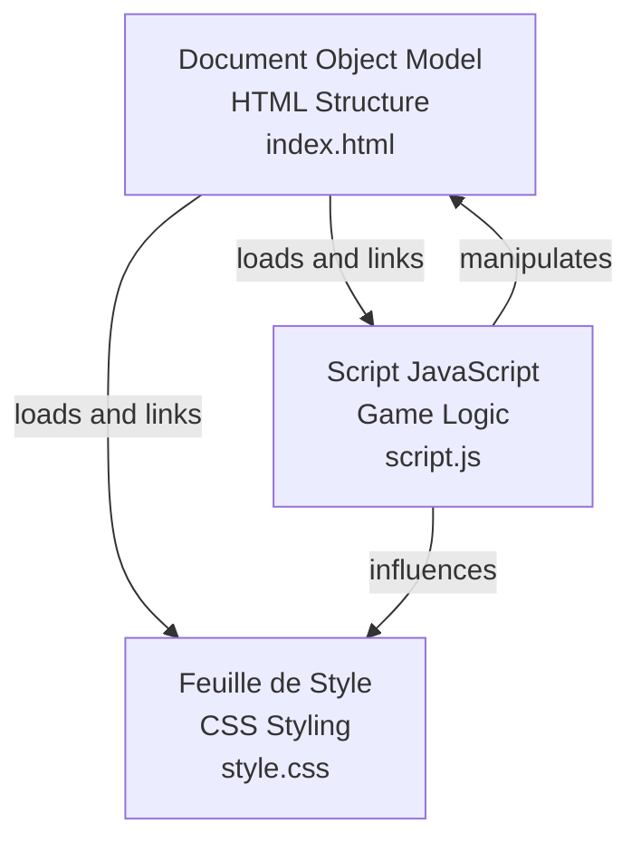
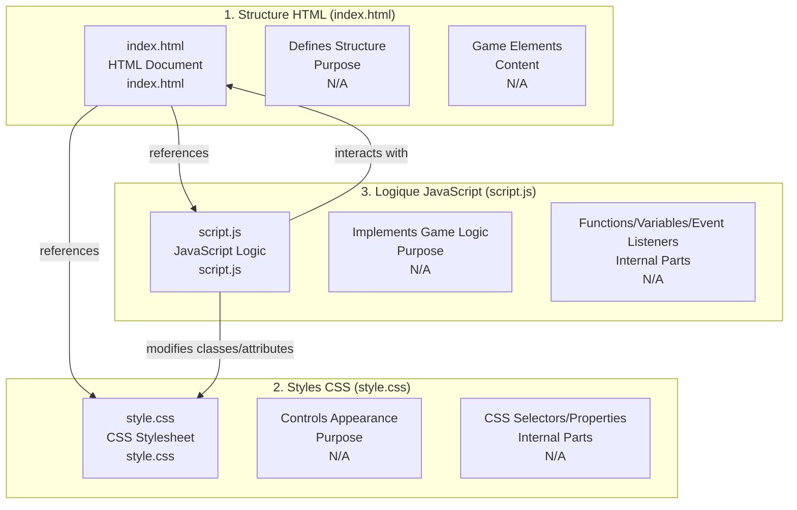

# Codebase Research Report

## Query
architecture de tout le projet en mon nom Tobi 

## Answer
# Architecture du Projet Tobi

Le projet "01-Candy-Crush-Game" est une application web front-end simple, structurée autour des technologies web fondamentales : HTML, CSS et JavaScript. Son architecture est de type client-side, où toute la logique et la présentation sont gérées directement par le navigateur de l'utilisateur.

## Architecture de Haut Niveau

L'application est composée de trois composants principaux qui collaborent pour offrir une expérience interactive :

*   Le **Document Object Model (DOM)**, défini par [index.html](index.html), fournit la structure et le contenu de la page web.
*   La **Feuille de Style en Cascade (CSS)**, définie par [style.css](style.css), gère la présentation visuelle et le style de l'interface utilisateur.
*   Le **Script JavaScript**, défini par [script.js](script.js), implémente la logique interactive, y compris la mécanique du jeu.

Ces composants interagissent de manière hiérarchique : [index.html](index.html) est le point d'entrée qui charge et lie [style.css](style.css) et [script.js](script.js). [script.js](script.js) manipule dynamiquement le contenu et les styles définis dans [index.html](index.html) et [style.css](style.css) respectivement.

## Composants Détaillés

### **1. Structure HTML (index.html)**

Le fichier [index.html](index.html) est le squelette de l'application.

*   **Son But :** Il définit la structure sémantique de la page web, inclut les métadonnées du document et sert de conteneur pour tous les éléments visuels et interactifs.
*   **Ses Parties Internes :** Il contient les balises HTML nécessaires à la création de l'interface du jeu, telles que les éléments pour le plateau de jeu, le score, etc. Il inclut également les liens vers la feuille de style externe et le script JavaScript.
*   **Ses Relations Externes :**
    *   Il référence [style.css](style.css) via une balise `<link>` pour appliquer les styles visuels.
    *   Il référence [script.js](script.js) via une balise `<script>` pour exécuter la logique applicative.

### **2. Styles CSS (style.css)**

Le fichier [style.css](style.css) est responsable de l'apparence visuelle de l'application.

*   **Son But :** Il définit les règles de style pour les éléments HTML, contrôlant leur disposition, leurs couleurs, leurs polices, leurs animations et leur réactivité.
*   **Ses Parties Internes :** Il contient des sélecteurs CSS et des déclarations de propriétés qui ciblent les éléments définis dans [index.html](index.html).
*   **Ses Relations Externes :** Il est lié à [index.html](index.html) et ses règles sont appliquées aux éléments du DOM.

### **3. Logique JavaScript (script.js)**

Le fichier [script.js](script.js) est le cœur interactif de l'application.

*   **Son But :** Il implémente la logique du jeu, gère les interactions utilisateur, manipule le DOM et met à jour l'état de l'application.
*   **Ses Parties Internes :** Il contient des fonctions, des variables et des écouteurs d'événements qui définissent le comportement du jeu (par exemple, la création du plateau, la gestion des mouvements, la détection des correspondances, la mise à jour du score).
*   **Ses Relations Externes :**
    *   Il interagit directement avec le DOM ([index.html](index.html)) pour créer, modifier ou supprimer des éléments HTML et pour attacher des gestionnaires d'événements.
    *   Il peut indirectement influencer l'application des styles en modifiant les classes ou les attributs des éléments HTML, ce qui déclenche les règles CSS définies dans [style.css](style.css).

---
*Generated by [CodeViz.ai](https://codeviz.ai) on 28/08/2025 13:24:49*
